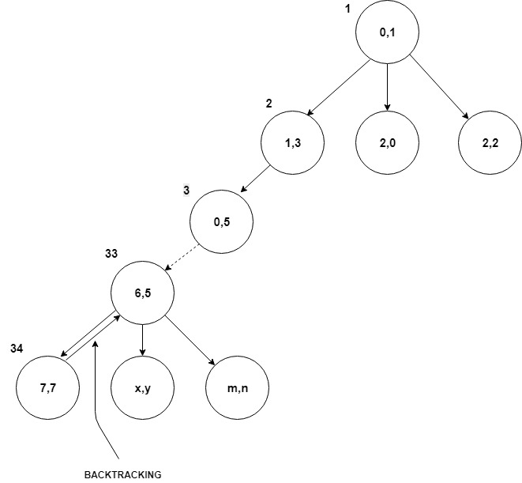

# knights-tour
Knight’s Tour is a sequence of valid moves of a knight on a chessboard in such a way that the knight covers all the squares on the board. This is a Hamiltonian path problem in computer science which is NP-complete. In this project, I compare the time complexities of Knight's Tour while implementing i) Backtracking, and ii) Warnsdorff's heuristic.

Backtracking of a knight in an 8x8 board.

The application running a knight's tour from (0,0) on an 8x8 board.
